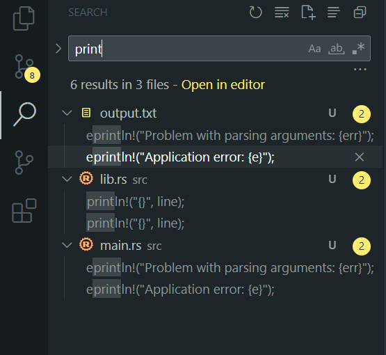

# MINIE WINIE GRIP (it's just a grep but with RUST 😎)

In Rust Docs (https://doc.rust-lang.org/book/ch12-00-an-io-project.html) there is project builing a command line program that perform the things like what grep does, searching for some string with some pattern that provided. In order to make this project better, i decide to make more complex system. this program will serach into some string pattern but rather than searching it in a file this minie winie grip will search in to a whole directory that provide. Also this program will return the reference to the related string, think its like string searcher in VsCode (ctrl + shift + f). cool right 😎

#
IGNORE_CASE=1 cargo run -- to poem.txt